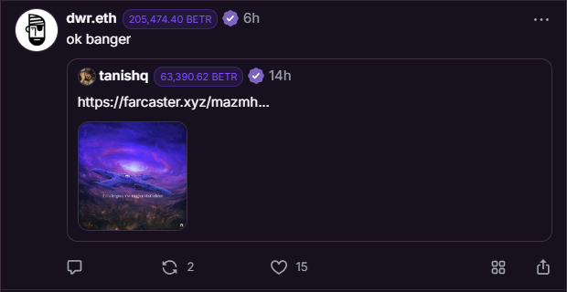
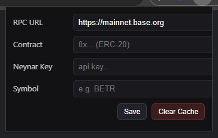

## Farcaster Token Balance Extension

This extension displays the user balance of a token next to the respective username.

### Usage
1. Open settings by clicking on the extension icon
2. Input contract address, Neynar API key, and token symbol
3. Enjoy!

### Considerations
- Must use personal Neynar API key to get wallet addresses for a user
    - If this gets enough traction, I may spin up a proper server for this, but for now, it's your own key
- API keys are stored in browser data.  This is an inherently unsafe place to store things, so if you care about about your Neynar key leaking, DO NOT USE THIS EXTENSION
- This uses a public RPC - you may get rate limited